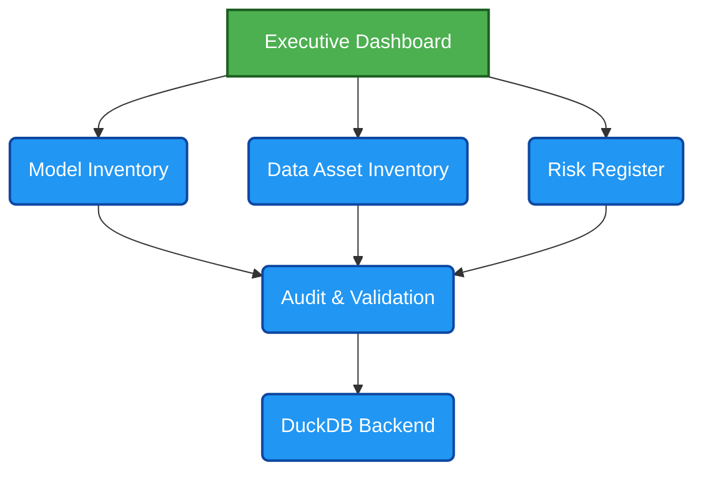
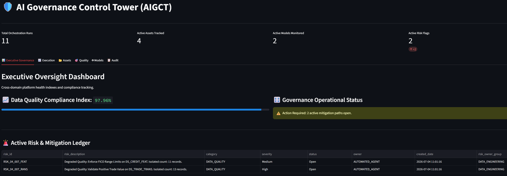
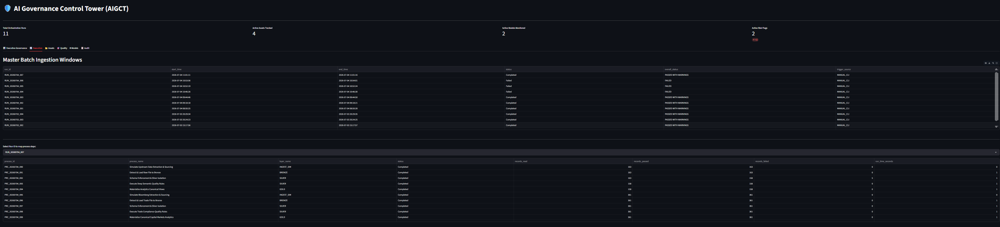
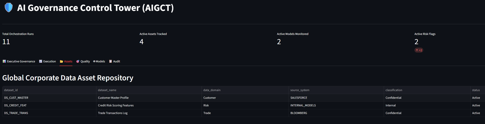
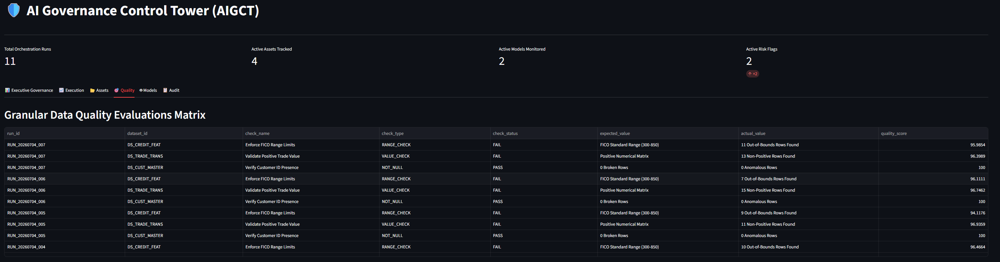
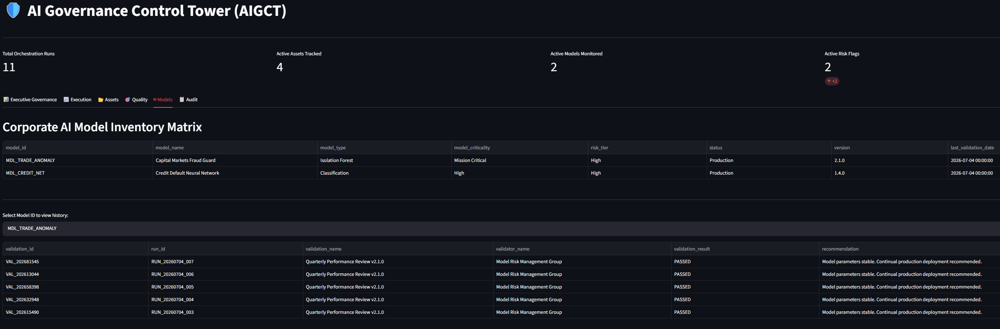
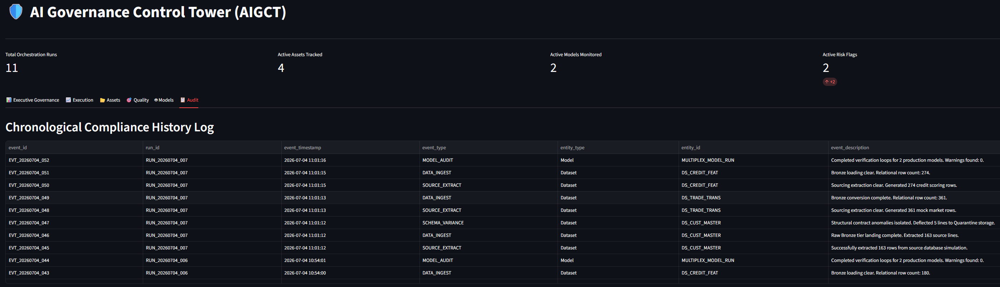

# AI Governance Control Tower

## 1. Executive Summary

AI Governance Control Tower is an open-source Responsible AI governance platform built for organizations operating in highly regulated environments. It provides a centralized control framework to oversee AI systems across the full lifecycle, enabling cross-functional governance across business, risk, compliance, legal, data, and technology teams. The platform brings together model inventory management, data asset governance, model validation, risk assessment, continuous monitoring, and defensible documentation to strengthen audit readiness and operational transparency. By aligning AI governance activities with leading regulatory and risk management frameworks such as NIST AI RMF, SR 11-7, BCBS 239, and the EU AI Act, AI Governance Control Tower helps organizations demonstrate accountability, support regulatory alignment, and scale responsible AI adoption with confidence.

## 2. Why This Project

Many organizations continue to manage AI governance through spreadsheets, documents, and disconnected control processes. As AI adoption accelerates, organizations require a more integrated approach to model governance, data governance, risk management, validation, auditability, and regulatory compliance.

AI Governance Control Tower demonstrates how governance can be operationalized through a centralized platform that combines inventory management, risk controls, validation workflows, audit readiness, and continuous monitoring.

This project is built from lessons learned managing enterprise data platforms, regulatory reporting ecosystems, cloud modernization programs, and governance controls across global investment banking environments.

## 3. Architecture Diagram

### 3.1. AI Governance Control Tower

Open-Source AI Governance Platform for Regulated Financial Services Environments



## 4. Regulatory Mapping Table

| **Component** | **NIST AI RMF** | **SR 11-7** | **EU AI Act** |
| :--- | :---: | :---: | :---: |
| Model Inventory | &#10003; | &#10003; | &#10003; |
| Validation | &#10003; | &#10003; | &#10003; |
| Risk Register | &#10003; | &#10003; | &#10003; |
| Audit Trail | &#10003; | &#10003; | &#10003; |
| Data Inventory | &#10003; | — | &#10003; |

## 5. Project Folder Structure

```text
ai-governance-control-tower/
├── architecture-decisions/                    # Architecture Decision Records
│   ├── ADR-001-run-id.md                     # Immutable execution tracking
│   ├── ADR-002-data-asset-inventory.md       # Data asset inventory design
│   ├── ADR-003-governance-execution.md       # Decoupled governance execution
│   └── ADR-004-unity-catalog.md              # Unity catalog integration
├── config/                                    # Configuration files and parameters
├── data/                                      # Data storage and management
│   ├── database/                              # Database files and schemas
│   ├── quarantine_vault/                      # Quarantined data for compliance
│   └── source_landing/                        # Raw data landing zone
│       ├── credit_daily.csv
│       ├── customers_daily.csv
│       ├── dummy-customers_daily.csv
│       └── trades_daily.csv
├── docs/                                      # Documentation and guides
│   ├── process_flow_metadata_mapping.md
│   └── images/                                # Documentation images and diagrams
├── notebooks/                                 # Jupyter notebooks for exploration
├── pipelines/                                 # Data processing and model pipelines
│   ├── credit_features_pipeline.py
│   ├── customer_master_pipeline.py
│   ├── model_validation_pipeline.py
│   └── trade_transactions_pipeline.py
├── src/                                       # Core source code
│   ├── database_manager.py                    # Database operations
│   ├── reference_data_seeder.py               # Reference data initialization
│   ├── risk_engine.py                         # Risk assessment engine
│   ├── schema_initializer.py                  # Schema and metadata setup
│   ├── tracker_engine.py                      # Audit and execution tracking
│   ├── databricks/                            # Databricks platform integration
│   │   └── pipeline_orchestration/
│   │       ├── ingest_to_bronze.py            # Bronze layer ingestion
│   │       ├── init_catalog.py                # Catalog initialization
│   │       ├── raw_generator.py               # Raw data generation
│   │       ├── test_connection.py             # Connection testing
│   │       └── transform_to_silver.py         # Silver layer transformations
│   └── sql/                                   # SQL scripts and queries
│       ├── init_schema_v1.3.sql               # Core schema initialization
│       └── databricks/
│           ├── core_meta_rules.sql            # Metadata governance rules
│           ├── semantic_meta_layer.sql        # Semantic metadata layer
│           └── system_access_table_mockup.sql # System access mocking
├── ui/                                        # User interface and dashboards
│   ├── main_dashboard.py                      # Executive dashboard
│   ├── Security Audit & Compliance Monitor.lvdash.json  # Security and Compliance Databricks dashboard 
│   └── pages/                                 # Dashboard page components
├── config.py                                  # Main configuration module
├── initialize.py                              # System initialization script
├── main_runner.py                             # Main application entry point
├── requirements.txt                           # Python dependencies
├── LICENSE                                    # Project license
└── README.md                                  # This file
```

## 6. Current Features & Capabilities

### Phase I: Foundation & Observability (Delivered)

- ✅ **Immutable Execution Tracking (ADR-001):** Mandates unique Run IDs across environments to ensure reproducible execution lineage.
- ✅ **Data Asset Inventory (ADR-002):** Automated structural cataloging of upstream datasets, features, and environments.
- ✅ **Model Inventory & Metadata Registry:** Captures model architecture metrics and training footprints.
- ✅ **Decoupled Governance Execution (ADR-003):** Established an isolated runtime engine for policy evaluation, shielding core application performance.
- ✅ **Audit Event Tracking:** Captures immutable logs of system transitions and runtime metadata.

### Phase II: Active Policy Enforcement (In Progress / Roadmap)

- ⏳ **Governance Policy Integration:** Actively parsing and mapping live data assets against defined enterprise risk guardrails.
- ⏳ **AI Risk Register Automation:** Programmatic scoring of risk vectors based on live asset data.
- ⏳ **Automated Model Validation Gates:** CI/CD blocking mechanisms if an asset fails policy criteria.

## 7. Screenshots & Interface Preview

Click on any section below to expand and view the interface captures for the Control Tower.

<details>
<summary>📊 View Phase I Dashboard Analytics (Executive & Model Posture)</summary>
<br>

| Executive Governance Dashboard | Model Inventory Management |
| :---: | :---: |
|  |  |
| *High-level compliance posture and risk tracking control plane.* | *Real-time tracking of active production models and metadata mapping.* |

</details>

<details>
<summary>🗂️ View Asset Inventory & Data Quality Previews</summary>
<br>

| Data Asset Inventory | Data Quality Rules & Profiling |
| :---: | :---: |
|  |  |
| *Automated structural cataloging of upstream datasets and feature stores.* | *Execution status of validation frameworks against the data layer.* |

</details>

<details>
<summary>⚖️ View Risk Registers & Audit Monitoring</summary>
<br>

| AI Risk Register | Audit Event Monitoring |
| :---: | :---: |
|  |  |
| *Dynamic inventory mapping active vulnerabilities and policy flags.* | *Immutable ledger of system executions and Run ID lineage.* |

</details>

## 7. Future Horizons (Azure Databricks Roadmap)

To scale the AI Governance Control Tower architecture to enterprise-grade cloud data platforms, the next phases of development will implement native integrations with Azure Databricks across three progressive milestones:

- **Milestone I (Data Posture):** Implementing Unity Catalog 3-level namespaces and automated column-level lineage tracking across the Medallion architecture. See [ADR-004: Unity Catalog Enterprise Data Layout](architecture-decisions/ADR-004-unity-catalog.md) for full architectural trade-offs.
- **Milestone II (Quality Gates):** Deploying Databricks Lakehouse Monitoring and SQL Alert notification loops for automated quarantine triggers.
- **Milestone III (GenAI Runtime Guardrails):** Integrating Unity AI Gateway service policies to enforce prompt/response content boundaries on serving endpoints.

### Long-Term Vision

Beyond the Databricks ecosystem integration, the ultimate platform runway includes:

- **Advanced Model Observability:** Incorporating statistical drift detection and automated performance degradation monitoring.
- **Programmatic Trust & Safety:** Deep integration of Explainable AI (XAI metrics) and algorithmic fairness checks natively into the execution pipeline.
- **Enterprise Workflows:** Automated policy approval lifecycles, risk heatmapping, and collaborative remediation queues.

## 8. 🏛️ AI Governance Control Tower

An enterprise-grade, zero-trust data governance platform built natively on **Azure Databricks**, **Unity Catalog**, and **AI/BI Dashboards (Lakeview)**. The platform delivers real-time access telemetry, automated audit logging, lineage extraction, and dynamic row-level & column-masking policy enforcement.

### 🚀 Key Features & Architectural Achievements

#### 🔒 1. Dynamic Zero-Trust Access Control (Milestone II)

- **Dynamic Column Masking:** Automatically masks sensitive PII fields (such as `account_id` and financial `amount`) based on the active user's Entra ID group permissions.
- **Row-Level Filtering:** Implements a dynamic filter ruleset (`core_meta_rules`) restricting downstream analytical rows to authorized domain regions, preventing unauthorized cross-tenant exposure.

#### 📊 2. Real-Time Telemetry & Auditing (Milestone III)

- **Unified System Access Schemas:** Leverages Databricks' centralized `system.access` metadata schemas.
- **Proactive Audit Trails:** Automatically indexes security activities from `system.access.audit` to trace queries and inspect client environments.
- **Data Lineage Mapping:** Tracks complete pipeline lineage from raw Bronze ingestion layers down to analytical Silver schemas via `system.access.table_lineage`.

#### 🎛️ 3. Executive Compliance Tower Dashboard (Milestone IV)

- **Interactive Filtering:** Allows compliance auditors to dynamically toggle user contexts (e.g., viewing an unmasked administrator audit path vs. a masked business analyst profile).
- **Security KPI Cards:** Real-time counter widgets tracking total access logs and security policy rules.
- **Interactive Table Trails:** A clean, horizontal grid-view of master data access events, exposing event timestamps, users, actions, and targeting tables without wrapping long string paths.

---

## 9. 🛠️ Deploying System Schemas (Avoid the Shard Routing Trap!)

During deployment, attempting to enable system schemas like `access` via local workspace APIs may result in:
`RESOURCE_DOES_NOT_EXIST: Cannot locate home shard for metastoreId...`

### The UI-Based Resolution:

To bypass workspace-level routing limitations:

1. Log into the **Databricks Account Console**: `https://accounts.azuredatabricks.net` using your **Microsoft Entra ID User Principal**.
2. Click **Catalog** on the left navigation pane.
3. Click on your active physical metastore (e.g., `metastore_azure_eastus`).
4. Select the **System Schemas** tab from the top sub-menu.
5. Click **Enable** directly next to **`access`**
