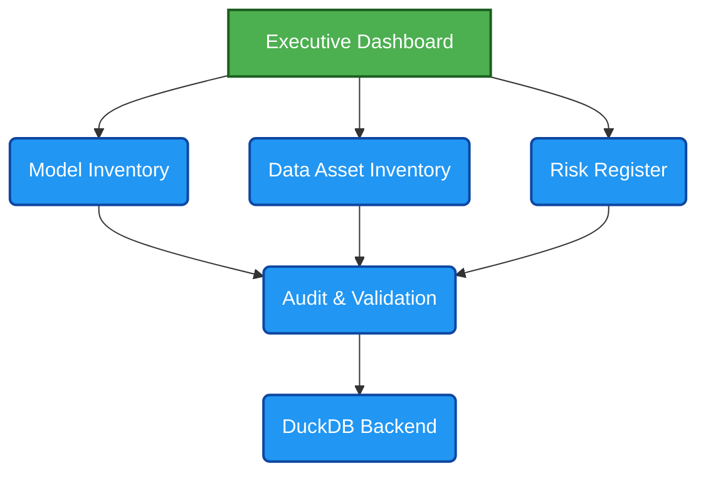

# AI Governance Control Tower

## 1. Executive Summary

AI Governance Control Tower is an open-source Responsible AI governance platform built for organizations operating in highly regulated environments. It provides a centralized control framework to oversee AI systems across the full lifecycle, enabling cross-functional governance across business, risk, compliance, legal, data, and technology teams. The platform brings together model inventory management, data asset governance, model validation, risk assessment, continuous monitoring, and defensible documentation to strengthen audit readiness and operational transparency. By aligning AI governance activities with leading regulatory and risk management frameworks such as NIST AI RMF, SR 11-7, BCBS 239, and the EU AI Act, AI Governance Control Tower helps organizations demonstrate accountability, support regulatory alignment, and scale responsible AI adoption with confidence.

## 2. Why This Project

Many organizations continue to manage AI governance through spreadsheets, documents, and disconnected control processes. As AI adoption accelerates, organizations require a more integrated approach to model governance, data governance, risk management, validation, auditability, and regulatory compliance.

AI Governance Control Tower demonstrates how governance can be operationalized through a centralized platform that combines inventory management, risk controls, validation workflows, audit readiness, and continuous monitoring.

This project is built from lessons learned managing enterprise data platforms, regulatory reporting ecosystems, cloud modernization programs, and governance controls across global investment banking environments.

## 3. Architecture Diagram

### 3.1. AI Governance Control Tower

Open-Source AI Governance Platform for Regulated Financial Services Environments

## 4. Regulatory Mapping Table

| **Component** | **NIST AI RMF** | **SR 11-7** | **EU AI Act** |
| :--- | :---: | :---: | :---: |
| Model Inventory | &#10003; | &#10003; | &#10003; |
| Validation | &#10003; | &#10003; | &#10003; |
| Risk Register | &#10003; | &#10003; | &#10003; |
| Audit Trail | &#10003; | &#10003; | &#10003; |
| Data Inventory | &#10003; | — | &#10003; |

## 5. Current Features & Capabilities

### Phase I: Foundation & Observability (Delivered)

- ✅ **Immutable Execution Tracking (ADR-001):** Mandates unique Run IDs across environments to ensure reproducible execution lineage.
- ✅ **Data Asset Inventory (ADR-002):** Automated structural cataloging of upstream datasets, features, and environments.
- ✅ **Model Inventory & Metadata Registry:** Captures model architecture metrics and training footprints.
- ✅ **Decoupled Governance Execution (ADR-003):** Established an isolated runtime engine for policy evaluation, shielding core application performance.
- ✅ **Audit Event Tracking:** Captures immutable logs of system transitions and runtime metadata.

### Phase II: Active Policy Enforcement (In Progress / Roadmap)

- ⏳ **Governance Policy Integration:** Actively parsing and mapping live data assets against defined enterprise risk guardrails.
- ⏳ **AI Risk Register Automation:** Programmatic scoring of risk vectors based on live asset data.
- ⏳ **Automated Model Validation Gates:** CI/CD blocking mechanisms if an asset fails policy criteria.

## 6. Screenshots & Interface Preview

Click on any section below to expand and view the interface captures for the Control Tower.

📊 View Phase I Dashboard Analytics (Executive & Model Posture)

 

| Executive Governance Dashboard | Model Inventory Management |
| :---: | :---: |
|  |  |
| *High-level compliance posture and risk tracking control plane.* | *Real-time tracking of active production models and metadata mapping.* |

🗂️ View Asset Inventory & Data Quality Previews

 

| Data Asset Inventory | Data Quality Rules & Profiling |
| :---: | :---: |
|  |  |
| *Automated structural cataloging of upstream datasets and feature stores.* | *Execution status of validation frameworks against the data layer.* |

⚖️ View Risk Registers & Audit Monitoring

 

| AI Risk Register | Audit Event Monitoring |
| :---: | :---: |
|  |  |
| *Dynamic inventory mapping active vulnerabilities and policy flags.* | *Immutable ledger of system executions and Run ID lineage.* |

## 7. Future Horizons (Azure Databricks Roadmap)

To scale the AI Governance Control Tower architecture to enterprise-grade cloud data platforms, the next phases of development will implement native integrations with Azure Databricks across three progressive milestones:

- **Milestone I (Data Posture):** Implementing Unity Catalog 3-level namespaces and automated column-level lineage tracking across the Medallion architecture. See [ADR-004: Unity Catalog Enterprise Data Layout](architecture-decisions/ADR-004-unity-catalog.md) for full architectural trade-offs.
- **Milestone II (Quality Gates):** Deploying Databricks Lakehouse Monitoring and SQL Alert notification loops for automated quarantine triggers.
- **Milestone III (GenAI Runtime Guardrails):** Integrating Unity AI Gateway service policies to enforce prompt/response content boundaries on serving endpoints.

### Long-Term Vision

Beyond the Databricks ecosystem integration, the ultimate platform runway includes:

- **Advanced Model Observability:** Incorporating statistical drift detection and automated performance degradation monitoring.
- **Programmatic Trust & Safety:** Deep integration of Explainable AI (XAI metrics) and algorithmic fairness checks natively into the execution pipeline.
- **Enterprise Workflows:** Automated policy approval lifecycles, risk heatmapping, and collaborative remediation queues.
