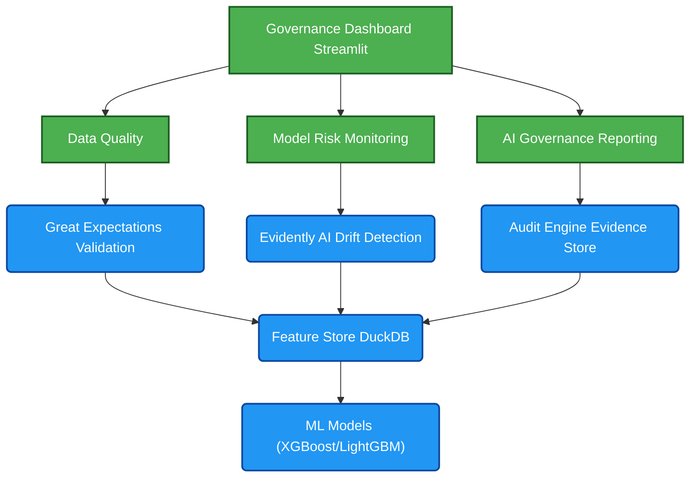

# AI Governance Control Tower

AI Governance Control Tower is an open-source governance platform for managing AI systems in regulated environments. The platform aligns with NIST AI RMF, SR 11-7, BCBS239, and EU AI Act principles through model inventory management, governance controls, risk classification, auditability, and continuous monitoring.

### Target Audience

**Business**

- CRO
- Chief
     Data Officer
- Chief
     AI Officer
- Model
     Risk Management

**Technology**

- Data
     Architects
- Data
     Engineers
- MLOps
     Teams

**Risk & Compliance**

- Internal
     Audit
- Regulatory
     Reporting
- Compliance

### Regulatory Alignment

**NIST AI RMF**

- Govern
- Map
- Measure
- Manage

**SR 11-7**

- Model
     Risk Management

**EU AI Act**

- Transparency
- Human
     Oversight
- Monitoring

**BCBS239**

- Data
     Quality
- Lineage
- Controls

### High-Level Architecture

