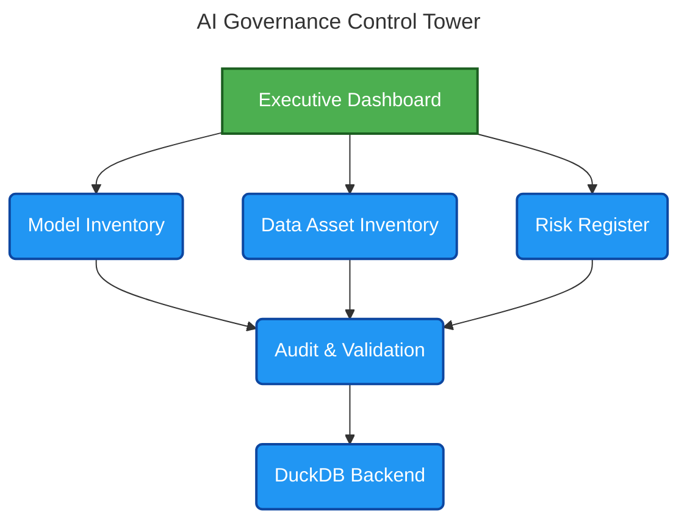

# AI Governance Control Tower

## 1. Executive Summary

AI Governance Control Tower is an open-source governance platform designed to help organizations manage, monitor, and evidence responsible AI practices across regulated environments. It serves as a centralized command center for AI oversight, bringing together model inventory management, data asset governance, model validation workflows, risk assessment, audit readiness, and continuous monitoring in a single operating framework. The platform enables cross-functional teams to improve transparency, strengthen accountability, streamline governance processes, and demonstrate alignment with leading regulatory and risk management frameworks, including NIST AI RMF, SR 11-7, BCBS 239, and the EU AI Act.

## 2. Architecture Diagram

## 3. Regulatory Mapping Table

| **Component** | **NIST AI RMF** | **SR 11-7** | **EU AI Act** |
| :--- | :---: | :---: | :---: |
| Model Inventory | &#10003; | &#10003; | &#10003; |
| Validation | &#10003; | &#10003; | &#10003; |
| Risk Register | &#10003; | &#10003; | &#10003; |
| Audit Trail | &#10003; | &#10003; | &#10003; |
| Data Inventory | &#10003; | — | &#10003; |

## 4. Current Features

### Governance Foundation (Phase 1)

✅ Model Inventory

✅ Data Asset Inventory

✅ AI Risk Register

✅ Governance Policies

✅ Model Validation

✅ Audit Event Tracking
