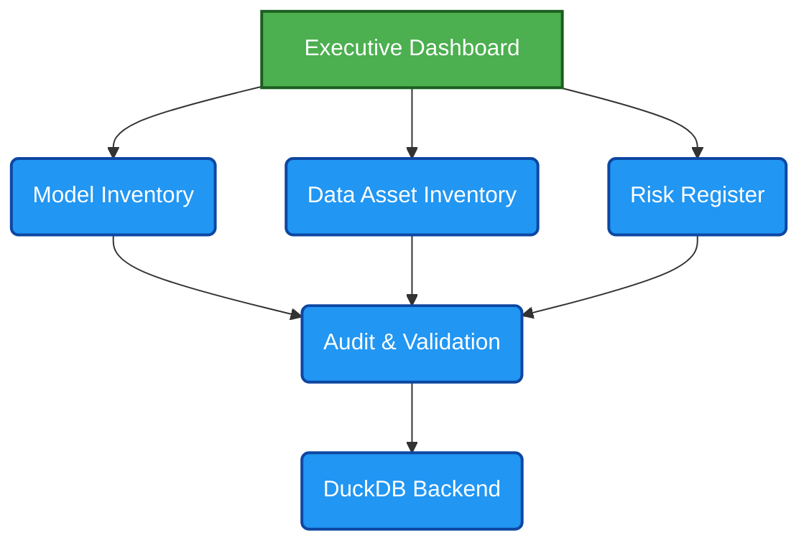

# AI Governance Control Tower

## 1. Executive Summary

AI Governance Control Tower is an open-source Responsible AI governance platform built for organizations operating in highly regulated environments. It provides a centralized control framework to oversee AI systems across the full lifecycle, enabling cross-functional governance across business, risk, compliance, legal, data, and technology teams. The platform brings together model inventory management, data asset governance, model validation, risk assessment, continuous monitoring, and defensible documentation to strengthen audit readiness and operational transparency. By aligning AI governance activities with leading regulatory and risk management frameworks such as NIST AI RMF, SR 11-7, BCBS 239, and the EU AI Act, AI Governance Control Tower helps organizations demonstrate accountability, support regulatory alignment, and scale responsible AI adoption with confidence.

## 2. Why This Project

Many organizations continue to manage AI governance through spreadsheets, documents, and disconnected control processes. As AI adoption accelerates, organizations require a more integrated approach to model governance, data governance, risk management, validation, auditability, and regulatory compliance.

AI Governance Control Tower demonstrates how governance can be operationalized through a centralized platform that combines inventory management, risk controls, validation workflows, audit readiness, and continuous monitoring.

This project is built from lessons learned managing enterprise data platforms, regulatory reporting ecosystems, cloud modernization programs, and governance controls across global investment banking environments.

## 3. Architecture Diagram

### 3.1. AI Governance Control Tower

Open-Source AI Governance Platform for Regulated Financial Services Environments

## 4. Regulatory Mapping Table

| **Component** | **NIST AI RMF** | **SR 11-7** | **EU AI Act** |
| :--- | :---: | :---: | :---: |
| Model Inventory | &#10003; | &#10003; | &#10003; |
| Validation | &#10003; | &#10003; | &#10003; |
| Risk Register | &#10003; | &#10003; | &#10003; |
| Audit Trail | &#10003; | &#10003; | &#10003; |
| Data Inventory | &#10003; | — | &#10003; |

## 5. Current Features

### Governance Foundation (Phase 1)

✅ Model Inventory

✅ Data Asset Inventory

✅ AI Risk Register

✅ Governance Policies

✅ Model Validation

✅ Audit Event Tracking

## 6. Screenshots

Coming Soon

- Executive Governance Dashboard
- Model Inventory Management
- AI Risk Register
- Audit Event Monitoring

## 7. Roadmap

### Phase 1 – Governance Foundation (Completed)

- Model Inventory
- Data Inventory
- Risk Register
- Policies
- Validation
- Audit Events

### Phase 2 – Data Quality Controls

- Great Expectations Integration
- Automated Data Quality Scoring

### Phase 3 – Model Monitoring

- Drift Detection
- Performance Monitoring

### Phase 4 – Explainability

- SHAP Integration
- Reason Codes

### Phase 5 – Fairness Monitoring

- Bias Metrics
- Fairlearn Integration

### Phase 6 – Governance Automation

- Policy Workflows
- Approval Workflows

### Phase 7 – Executive Control Tower

- Governance KPIs
- Risk Heatmaps
- Compliance Dashboards
