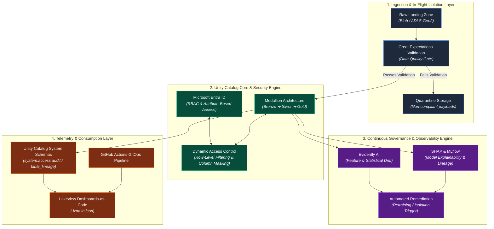

# 03. Architecture Overview

## Executive Summary

The **AI Governance Control Tower (AIGCT)** is a modular, event-driven governance and observability architecture built natively on **Azure Databricks** and **Unity Catalog**. 

Rather than relying on external sidecars or gateway proxies that introduce latency and administrative bloat, AIGCT operates directly within the Lakehouse execution layer. It leverages Unity Catalog's unified metastore, system schemas, dynamic data masking routines, and delta telemetry to enforce continuous, zero-trust governance across data assets, feature stores, and MLOps/LLM workloads.

---

## High-Level System Topology

The AIGCT ecosystem is partitioned into four primary functional layers: **Ingestion & In-Flight Control**, **Unity Catalog Storage & Policy Engine**, **Continuous Governance & Observability Engine**, and **Telemetry & Consumption Layer**.

