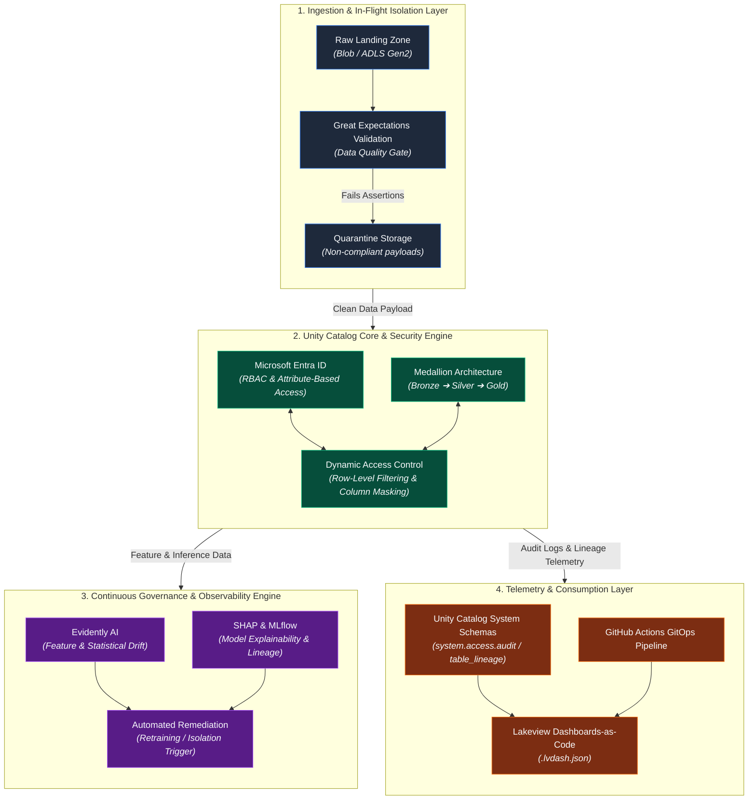
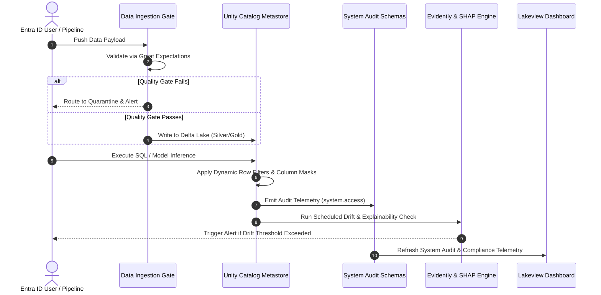

# 03. Architecture Overview

## Executive Summary

The **AI Governance Control Tower (AIGCT)** is a modular, event-driven governance and observability architecture built natively on **Azure Databricks** and **Unity Catalog**. 

Rather than relying on external sidecars or gateway proxies that introduce latency and administrative bloat, AIGCT operates directly within the Lakehouse execution layer. It leverages Unity Catalog's unified metastore, system schemas, dynamic data masking routines, and delta telemetry to enforce continuous, zero-trust governance across data assets, feature stores, and MLOps/LLM workloads.

---

## High-Level System Topology

The AIGCT ecosystem is partitioned into four primary functional layers: **Ingestion & In-Flight Control**, **Unity Catalog Storage & Policy Engine**, **Continuous Governance & Observability Engine**, and **Telemetry & Consumption Layer**.

## Core Architectural Layers

### 1. Ingestion & Active Isolation Layer

- **Great Expectations In-Flight Quality Gates:** Raw data entering the Lakehouse passes through automated expectation suites. Any payload failing schemas or business assertions is automatically diverted to a isolated Quarantine Lakehouse for review, preventing downstream model contamination.

#### 2. Unity Catalog Security Engine (Active Protection)

- **Identity-Centric Entitlements:** Integrated directly with Microsoft Entra ID service principals and user groups.
- **Dynamic Row-Level Filtering (RLS) & Column Masking:** Policy functions are applied at the metastore level. Users querying `⁠Gold`⁠ layer tables dynamically receive masked PII/SPI attributes based on their session context without creating duplicate physical datasets.

### 3. Continuous Governance & Observability Engine

- **Statistical Feature & Model Drift:** Evidently AI evaluates production feature distributions against baseline training sets to detect covariance shift and feature degradation.
- **Explainability (SHAP) & MLflow Registry:** Every production prediction is tracked alongside model lineage and SHAP feature importance values in MLflow.

### 4. Telemetry & GitOps CI/CD Layer

- **Native Audit Logging:** Extracts raw access records and table-level lineage directly from Unity Catalog metastore system schemas (⁠`system.access.audit`⁠, `⁠system.access.table_lineage`⁠).
- **Dashboards-as-Code:** Telemetry is exposed via declarative Lakeview Dashboards (⁠`.lvdash.json`⁠), fully deployed and versioned using GitHub Actions.

## Data & Telemetry Lifecycle Flow

The flow below illustrates how raw data transitions into audited insights while enforcing all 4 AIGCT pillars:

## Technical Stack Reference

| Component | Technology/Tool | Architectural Purpose |
| :--- | :--- | :--- |
| Compute / Lakehouse | Azure Databricks (Photon Runtime) | Scalable engine for ETL, streaming, and model inference. |
| Governance Engine | Databricks Unity Catalog | Metastore-level access control, lineage, and audit schemas. |
| Identity Management | Microsoft Entra ID (Azure AD) | Unified SSO, group-based access (RBAC/ABAC), and service principals. |
| Data Quality Gate | Great Expectations | Active pre-ingestion validation and quarantine routing. |
| Observability / Drift | Evidently AI + SHAP | Statistical drift tracking, data distribution shifts, and ML explainability. |
| Experiment Tracking | MLflow | Model versioning, lineage tracking, and artifact registry. |
| CI/CD & Automation | GitHub Actions + Databricks CLI | GitOps deployment of dashboards (`.lvdash.json`) and notebooks. |

