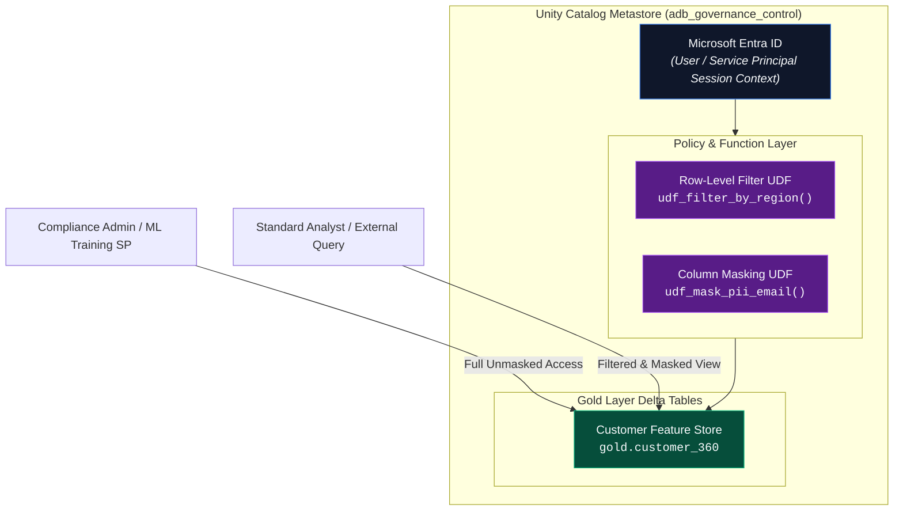

# 04. Active Protection Engine

## Executive Summary

The **Active Protection Engine** is the primary inline defensive mechanism of the **AI Governance Control Tower (AIGCT)**. Built natively on **Databricks Unity Catalog**, it eliminates traditional governance anti-patterns—such as maintaining duplicate "sanitized" datasets or running external sidecar proxies that increase latency.

By leveraging **Dynamic Row-Level Filtering (RLS)** and **Column Masking**, AIGCT enforces fine-grained access control at the metastore execution layer. Security policy decisions are evaluated dynamically per-query based on the caller's **Microsoft Entra ID** identity and group membership, ensuring true Zero-Trust security across SQL, Python, and MLOps workloads.

---

## Architectural Principles

1. **Single Source of Truth (SSOT):** Storage of duplicate datasets (e.g., a masked copy vs. an unmasked copy) is prohibited. Data is stored once in Gold/Silver Delta Lake tables and dynamically filtered upon reading.
2. **Zero-Trust Policy Enforcement:** Access is denied by default. Entitlements are evaluated at the engine level regardless of whether access originates from an interactive SQL query, a Databricks notebook, or an automated ML pipeline.
3. **Decoupled Governance Logic:** Security policy SQL functions (`UDFs`) are maintained independently of underlying physical table definitions, allowing global policy updates without schema migrations.

---

## Architecture Topology



## Technical Deep-Dive: Policy Implementation

### 1. Dynamic Column Masking (PII Protection)
Column masking functions dynamically transform or redact specific cell values based on the execution context of ⁠IS_ACCOUNT_GROUP_MEMBER()⁠.

#### SQL Definition: Email Redaction UDF

```SQL
CREATE OR REPLACE FUNCTION adb_governance_control.policies.mask_email(
    email STRING
)
RETURNS STRING
RETURN IF(
    IS_ACCOUNT_GROUP_MEMBER('pii_data_access_group') OR IS_ACCOUNT_GROUP_MEMBER('account admins'),
    email,
    REGEXP_REPLACE(email, '(^.).*(@.*$)', '$1***$2') -- Transforms 'john.doe@example.com' -> 'j***@example.com'
);
```

#### Binding Masking Function to Table Column

```SQL
ALTER TABLE adb_governance_control.gold.customer_features 
ALTER COLUMN email SET MASK adb_governance_control.policies.mask_email;
```


