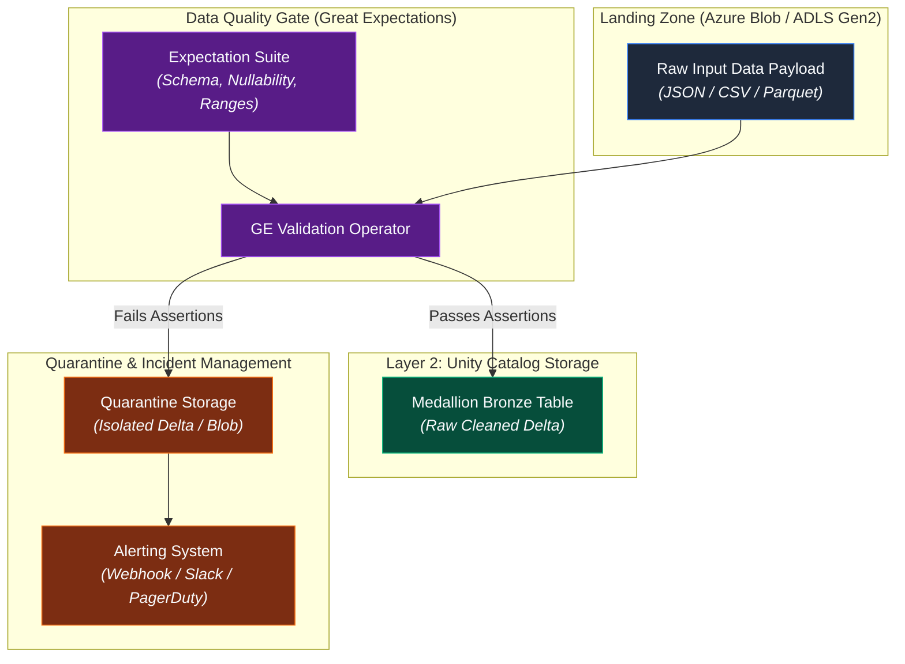

# 05. Data Quality Ingestion Gate

## Executive Summary

The **Data Quality Ingestion Gate** acts as the primary in-flight firewall of the **AI Governance Control Tower (AIGCT)**. Situated in **Layer 1 (Ingestion & In-Flight Isolation)**, it ensures that unvalidated or corrupted data is halted before it can pollute downstream Medallion Delta Lake storage (Bronze/Silver/Gold).

By integrating **Great Expectations (GE)** into the ingestion pipeline, AIGCT programmatically validates incoming data streams against strict data contracts, schemas, and statistical assertions. Payloads passing validation seamlessly flow into Unity Catalog, while non-compliant records are automatically routed to isolated Quarantine storage and trigger real-time alerts.

## Architectural Principles

1. **Shift-Left Validation:** Quality, integrity, and schema checks are executed at the landing zone prior to Delta table ingestion, minimizing compute and cleaning costs downstream.
2. **Circuit Breaker Pattern:** If critical assertion thresholds fail (e.g., unexpected `NULL` values in primary keys or missing PII tags), processing halts automatically to prevent data corruption.
3. **Automated Quarantine & Remediation:** Bad payloads are never dropped silently. They are segregated with full error metadata to facilitate root-cause analysis without blocking clean data pipelines.

---

## Architecture Topology



## Processing Sequence & Circuit Breaker Logic

The step-by-step validation lifecycle operates synchronously during batch ingestion or as a micro-batch trigger in streaming pipelines:

```mermaid
sequenceDiagram
    autonumber
    actor Pipeline as Ingestion Job / Orchestrator
    participant Landing as ADLS Gen2 Landing Zone
    participant GE as Great Expectations Engine
    participant Bronze as UC Bronze Delta Table
    participant Quarant as Quarantine Storage

    Pipeline->>Landing: Detect New Inbound Payload
    Pipeline->>GE: Trigger Validation Suite Execution
    
    rect rgb(30, 41, 59)
        note over GE: Evaluate Data Expectations
        GE->>GE: Check Schema Compliance
        GE->>GE: Check Null Counts & Value Ranges
        GE->>GE: Evaluate Business Rules & Regex
    end

    alt All Critical Expectations Pass
        GE-->>Pipeline: Validation Succeeded
        Pipeline->>Bronze: Append Clean Data Payload
    else Any Critical Expectation Fails
        GE-->>Pipeline: Validation Failed (Raise Circuit Breaker)
        Pipeline->>Quarant: Divert Payload + Error Logs
        Pipeline->>Pipeline: Trigger Notification & Log Failure Telemetry
    end
```



## Key Expectation Categories

AIGCT enforces three tiers of validation checks using Great Expectations:

| Check Category | Description | Sample GE Expectation | Action on Failure |
| :--- | :--- | :--- | :--- |
| Schema Integrity | Ensures required columns and data types exist. | expect_table_columns_to_match_ordered_list | Hard Stop (Quarantine) |
| Completeness | Prevents null or missing values in critical identifiers. | expect_column_values_to_not_be_null | Hard Stop (Quarantine) |
| Domain Validity | Confirms numerical boundaries, string formats, or regex patterns. | expect_column_values_to_be_between | Soft Warning / Quarantine |

## Python / Great Expectations Code Implementation

Below is a declarative Python implementation snippet integrated within a Databricks Ingestion Job.

```Python
import great_expectations as gx

# Initialize GE Data Context
context = gx.get_context()

# Load Batch Data from Landing Zone
batch_request = context.get_datasource("adls_landing_zone").get_batch_request()

# Define or Retrieve Expectation Suite
suite_name = "customer_ingestion_quality_suite"
validator = context.get_validator(
    batch_request=batch_request,
    expectation_suite_name=suite_name
)

# Apply Assertions
validator.expect_column_values_to_not_be_null(column="customer_id")
validator.expect_column_values_to_match_regex(column="email", regex=r"^[\w\.-]+@[\w\.-]+\.\w+$")
validator.expect_column_values_to_be_between(column="age", min_value=18, max_value=120)

# Save and Run Validation
validation_result = validator.validate()

# Circuit Breaker Logic
if not validation_result.success:
    # Route to Quarantine Zone with Error Context
    quarantine_path = "abfss://quarantine@storage.dfs.core.windows.net/failed_ingestions/"
    df_failed = validator.execution_engine.dataframe
    df_failed.write.format("delta").mode("append").save(quarantine_path)
    
    raise ValueError(f"Ingestion Circuit Breaker Triggered: Data Quality Validation Failed. Details: {validation_result}")
else:
    # Proceed to Unity Catalog Bronze Layer
    df_clean = validator.execution_engine.dataframe
    df_clean.write.format("delta").mode("append").saveAsTable("adb_governance_control.bronze.customer_raw")
```


