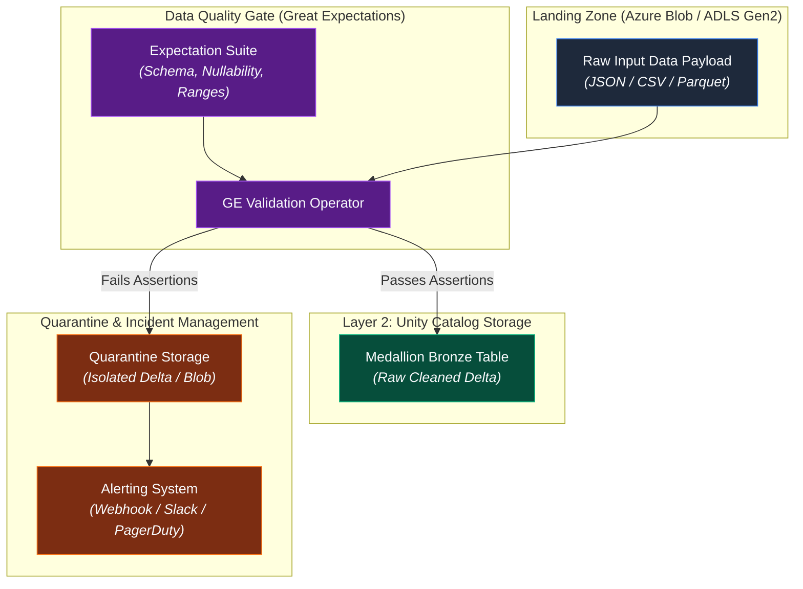

# 05. Data Quality Ingestion Gate

## Executive Summary

The **Data Quality Ingestion Gate** acts as the primary in-flight firewall of the **AI Governance Control Tower (AIGCT)**. Situated in **Layer 1 (Ingestion & In-Flight Isolation)**, it ensures that unvalidated or corrupted data is halted before it can pollute downstream Medallion Delta Lake storage (Bronze/Silver/Gold).

By integrating **Great Expectations (GE)** into the ingestion pipeline, AIGCT programmatically validates incoming data streams against strict data contracts, schemas, and statistical assertions. Payloads passing validation seamlessly flow into Unity Catalog, while non-compliant records are automatically routed to isolated Quarantine storage and trigger real-time alerts.

## Architectural Principles

1. **Shift-Left Validation:** Quality, integrity, and schema checks are executed at the landing zone prior to Delta table ingestion, minimizing compute and cleaning costs downstream.
2. **Circuit Breaker Pattern:** If critical assertion thresholds fail (e.g., unexpected `NULL` values in primary keys or missing PII tags), processing halts automatically to prevent data corruption.
3. **Automated Quarantine & Remediation:** Bad payloads are never dropped silently. They are segregated with full error metadata to facilitate root-cause analysis without blocking clean data pipelines.

---

## Architecture Topology

