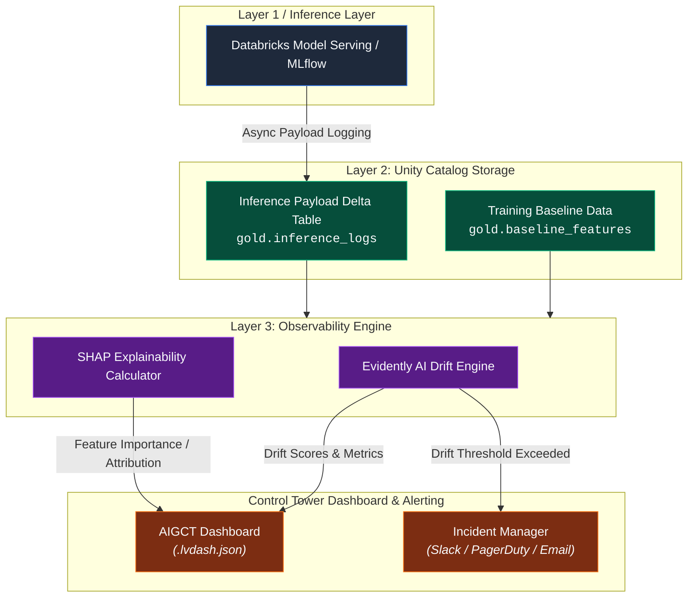

# 06. Observability and ML Monitoring Engine

## Executive Summary

The **Observability and ML Monitoring Engine** powers **Pillar 3 (Operational Health)** within the **AI Governance Control Tower (AIGCT)**. Machine learning models and generative AI systems degrade over time due to shifting real-world data patterns (concept drift) and underlying covariate shifts (data drift).

Situated in **Layer 3 (Observability & Telemetry)**, this engine utilizes **Evidently AI** for automated statistical drift detection and performance monitoring, alongside **SHAP (SHapley Additive exPlanations)** for localized and global feature explainability. By processing inference payload logs stored in Delta Lake tables, AIGCT continuously evaluates model health without impacting live serving latency.

---

## Architectural Principles

1. **Asynchronous Monitoring:** Telemetry collection and drift analysis are fully decoupled from real-time model inference endpoints to avoid adding serving latency.
2. **Statistical Rigor:** Drift and anomaly detection rely on non-parametric statistical tests (e.g., Kolmogorov-Smirnov, Wasserstein distance, Chi-Square) tailored to individual feature data types.
3. **Transparent Explainability:** Model predictions must be interpretable by human operators and auditors using deterministic feature attribution frameworks (SHAP).

---

## Architecture Topology



## Telemetry Flow & Drift Evaluation Lifecycle

```mermaid
sequenceDiagram
    autonumber
    actor Client as Application / User
    participant Model as Serving Endpoint (MLflow)
    participant UC as Unity Catalog (Delta Logs)
    participant Obs as Observability Job (Evidently + SHAP)
    participant Alert as Governance Incident System

    Client->>Model: Predict Request Payload
    Model-->>Client: Inference Response
    Model->>UC: Async Write Request/Response to `gold.inference_logs`
    
    rect rgb(30, 41, 59)
        note over Obs: Scheduled / Batch Monitoring Pipeline
        Obs->>UC: Fetch Baseline vs. Production Payload Window
        Obs->>Obs: Calculate Data Drift & Covariate Shift
        Obs->>Obs: Compute SHAP Value Distributions
    end

    alt Drift Metric > Threshold (e.g., p-value < 0.05)
        Obs->>Alert: Trigger Model Degradation Alert
        Obs->>UC: Write Metric Event to `system.governance.metrics`
    else Metrics within Normal Range
        Obs->>UC: Record Health Metric Event
    end
```



## Technical Deep-Dive: Drift and Explainability Implementation

### 1. Statistical Drift Detection with Evidently AI

Data drift compares current production inference logs against a reference dataset (e.g., the training baseline).

```Python
import pandas as pd
from datetime import datetime, timedelta
from evidently.report import Report
from evidently.metric_preset import DataDriftPreset, TargetDriftPreset
from pyspark.sql import SparkSession

spark = SparkSession.builder.getOrCreate()

# 1. Fetch Reference (Training Data) and Current (Inference Logs)
reference_df = spark.table("adb_governance_control.gold.baseline_features").toPandas()

# Fetch last 7 days of inference payload logs
current_df = spark.table("adb_governance_control.gold.inference_logs") \
    .filter(f"timestamp >= '{datetime.now() - timedelta(days=7)}'") \
    .toPandas()

# 2. Configure and Run Evidently Drift Report
data_drift_report = Report(metrics=[
    DataDriftPreset(drift_share=0.2), # Alert if >20% of features drift
    TargetDriftPreset()
])

data_drift_report.run(reference_data=reference_df, current_data=current_df)
report_json = data_drift_report.json()

# 3. Evaluate Results & Log Metrics
drift_summary = data_drift_report.as_dict()
dataset_drifted = drift_summary["metrics"][0]["result"]["dataset_drift"]

if dataset_drifted:
    # Trigger Governance Action or Retraining Pipeline
    print(f"[ALERT] Significant Data Drift Detected on Model Endpoint!")
```

### 2. Explainability via SHAP (SHapley Additive exPlanations)

To ensure compliance with explainable AI mandates (e.g., EU AI Act high-risk requirements), predictions are annotated with SHAP values.

```Python
import shap
import mlflow

# Load current production model from Unity Catalog Model Registry
model_uri = "models:/adb_governance_control.models.customer_churn_model@champion"
loaded_model = mlflow.pyfunc.load_model(model_uri)

# Compute Tree/Kernel SHAP values on sample production batch
explainer = shap.Explainer(loaded_model.unwrap_python_model())
shap_values = explainer(current_df[feature_columns])

# Extract Global Feature Importance for Governance Telemetry
global_importance = pd.DataFrame({
    'feature': feature_columns,
    'mean_abs_shap': abs(shap_values.values).mean(axis=0)
})

# Write SHAP values to Governance Storage for Audit Readiness
spark_shap_df = spark.createDataFrame(global_importance)
spark_shap_df.write.format("delta").mode("append").saveAsTable("adb_governance_control.observability.model_explainability_metrics")

```

## Metrics Breakdown & Thresholds

| Metric | Tool | Mathematical Method / Test | Target Threshold | Action on Violation |
| :--- | :--- | :--- | :--- | :--- |
| Numerical Feature Drift | Evidently AI | Kolmogorov-Smirnov (KS) Test | p - value < 0.05 | Flag Warning / Email |
| Categorical Feature Drift | Evidently AI | Chi-Square (x2) Goodness-of-Fit | p - value < 0.05 | Flag Warning |
| Dataset Drift Share | Evidently AI | Percentage of drifted features | > 20% of features | Raise High Incident |
| Feature Attribution Shift | SHAP | Mean Absolute SHAP Rank Change | Top 3 features shifted | Flag for Model Review |

