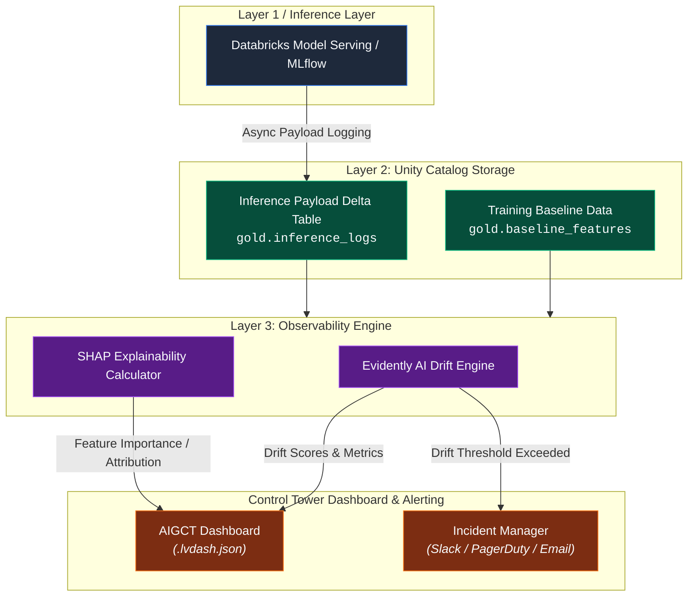

# 06. Observability and ML Monitoring Engine

## Executive Summary

The **Observability and ML Monitoring Engine** powers **Pillar 3 (Operational Health)** within the **AI Governance Control Tower (AIGCT)**. Machine learning models and generative AI systems degrade over time due to shifting real-world data patterns (concept drift) and underlying covariate shifts (data drift).

Situated in **Layer 3 (Observability & Telemetry)**, this engine utilizes **Evidently AI** for automated statistical drift detection and performance monitoring, alongside **SHAP (SHapley Additive exPlanations)** for localized and global feature explainability. By processing inference payload logs stored in Delta Lake tables, AIGCT continuously evaluates model health without impacting live serving latency.

---

## Architectural Principles

1. **Asynchronous Monitoring:** Telemetry collection and drift analysis are fully decoupled from real-time model inference endpoints to avoid adding serving latency.
2. **Statistical Rigor:** Drift and anomaly detection rely on non-parametric statistical tests (e.g., Kolmogorov-Smirnov, Wasserstein distance, Chi-Square) tailored to individual feature data types.
3. **Transparent Explainability:** Model predictions must be interpretable by human operators and auditors using deterministic feature attribution frameworks (SHAP).

---

## Architecture Topology

