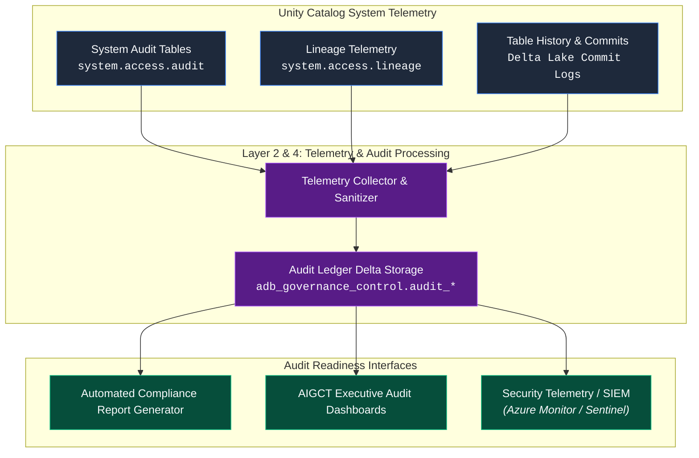

# 07. Telemetry and Audit Readiness Engine

## Executive Summary

The **Telemetry and Audit Readiness Engine** underpins **Pillar 2 (Audit Readiness)** of the **AI Governance Control Tower (AIGCT)**. Compliance failures often stem not from lack of security, but from an inability to prove adherence to regulations over time. 

Operating across **Layer 2 (Unity Catalog Core Storage)** and **Layer 4 (Governance & Policy Engine)**, this engine establishes an immutable, continuous audit trail. By capturing system-level telemetry, access requests, schema evolution, and model lifecycle events into centralized system tables, AIGCT transforms manual compliance preparation into an automated, push-button audit reporting process.

## Architectural Principles

1. **Immutable Compliance Ledger:** Audit logs, access histories, and policy updates are append-only and cryptographically secured to prevent tampering or retrospective alteration.
2. **Automated Traceability:** End-to-end data lineage—from raw landing zone files down to feature tables, model endpoints, and downstream dashboards—is captured automatically without manual operator tagging.
3. **Continuous Audit Readiness:** Governance telemetry is aggregated in real time, ensuring compliance reports (e.g., EU AI Act, NIST AI RMF, GDPR) can be generated on demand at any point in time.

## Architecture Topology



## Audit Telemetry Lifecycle & Lineage Flow

```mermaid
sequenceDiagram
    autonumber
    actor User as Data Engineer / AI Agent
    participant UC as Unity Catalog Engine
    participant SystemTables as System Audit Tables
    participant AuditEngine as Telemetry Engine
    participant Auditor as Compliance Auditor / Inspector

    User->>UC: Execute Query / Model Fine-Tuning / Policy Update
    UC->>SystemTables: Async Write Event Telemetry (Who, What, When, Query Hash)
    
    rect rgb(30, 41, 59)
        note over AuditEngine: Continuous Telemetry Processing Pipeline
        AuditEngine->>SystemTables: Fetch Audit & Lineage Delta Stream
        AuditEngine->>AuditEngine: Enrich with Regulatory Mapping Tag (e.g., EU AI Act Art. 12)
        AuditEngine->>AuditEngine: Store Encrypted Snapshot in Immutable Delta Table
    end

    Auditor->>AuditEngine: Request Model Pedigree & Access Log Report
    AuditEngine-->>Auditor: Export Immutable Audit Bundle (PDF / JSON / Interactive Dash)
```



## Key System Tables & Audit Telemetry Schema

AIGCT consolidates raw Unity Catalog events into standardized governance schemas:

| **System Table Source** | **Governance Target Schema** | **Key Telemetry Attributes Captured** |
| :--- | :--- | :--- |
| system.access.audit | audit.user_query_events | User identity, client IP, target table/column, applied mask/filter policy, timestamp, status. |
| system.access.table_lineage | audit.data_lineage_graph | Source table, target table, pipeline run ID, execution context, dependency hierarchy. |
| system.access.column_lineage | audit.feature_lineage_graph | Source column, target ML feature, derivation function/transformation statement. |
| system.billing.usage | audit.resource_consumption | Cluster ID, SKU, compute duration, cost center tag, carbon footprint metrics. |

## SQL Implementation: Automated Audit & Lineage Query

Below is an analytical SQL implementation used by AIGCT to assemble a complete data-to-model audit pedigree for a specific production model:

```SQL
-- Reconstruct Full Data & Model Pedigree for Compliance Audit
WITH ModelLineage AS (
    SELECT 
        entity_type,
        entity_name AS model_name,
        source_type,
        source_name AS source_table,
        created_by,
        created_at
    FROM system.access.table_lineage
    WHERE entity_name = 'adb_governance_control.models.customer_churn_model'
),
QueryAudit AS (
    SELECT 
        user_identity.email AS accessed_by,
        service_name,
        action_name,
        request_params.full_name_arg AS table_accessed,
        event_time
    FROM system.access.audit
    WHERE request_params.full_name_arg IN (SELECT source_table FROM ModelLineage)
)
SELECT 
    m.model_name,
    m.source_table,
    q.accessed_by,
    q.action_name,
    q.event_time,
    m.created_by AS model_owner
FROM ModelLineage m
JOIN QueryAudit q ON m.source_table = q.table_accessed
ORDER BY q.event_time DESC;
```

