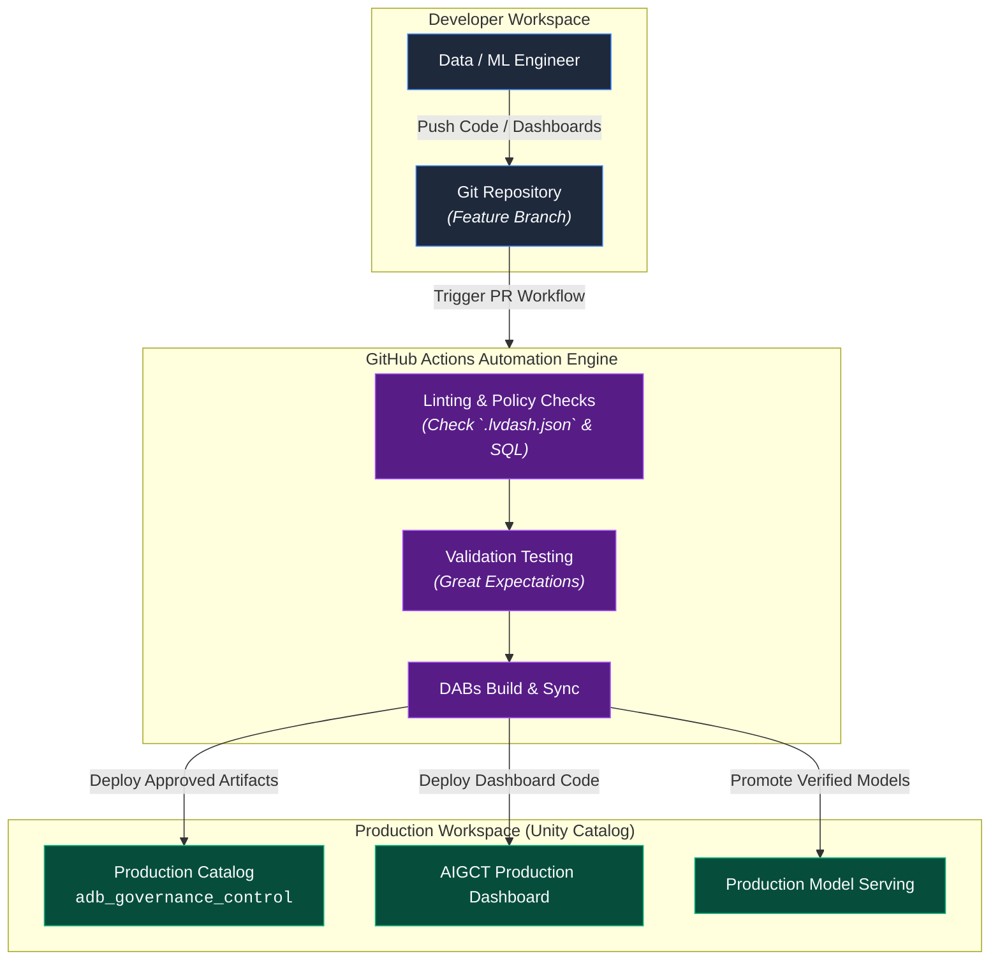

# 08. Continuous Governance and CI CD Engine

## Executive Summary

The **Continuous Governance and CI/CD Engine** embodies **Pillar 4 (Continuous Governance)** of the **AI Governance Control Tower (AIGCT)**. In fast-paced enterprise environments, static security and policy rules quickly become stale. Governance must evolve alongside codebase updates, model retraining, and schema iterations.

Operating across **Layer 4 (Governance & Policy Engine)**, this framework treats governance rules, dashboard metrics, data quality gates, and security configurations as software artifacts ("Governance-as-Code"). Utilizing **GitHub Actions**, **Databricks Asset Bundles (DABs)**, and automated policy testing, AIGCT guarantees that no model, pipeline, or dashboard is promoted to production without passing strict policy checks.

## Architectural Principles

1. **Governance-as-Code:** All security rules, data quality expectations, masking policies, and dashboards (`.lvdash.json`) are version-controlled in Git.
2. **Automated Promotion Gates:** Code and model deployments across environments (Dev $\rightarrow$ Staging $\rightarrow$ Prod) must pass automated policy compliance checks before deployment.
3. **Drift and Policy Guardrails:** Any pull request attempting to bypass row-level security or disable quality checks is automatically blocked by CI/CD linter workflows.

## Continuous Governance Pipeline Architecture

