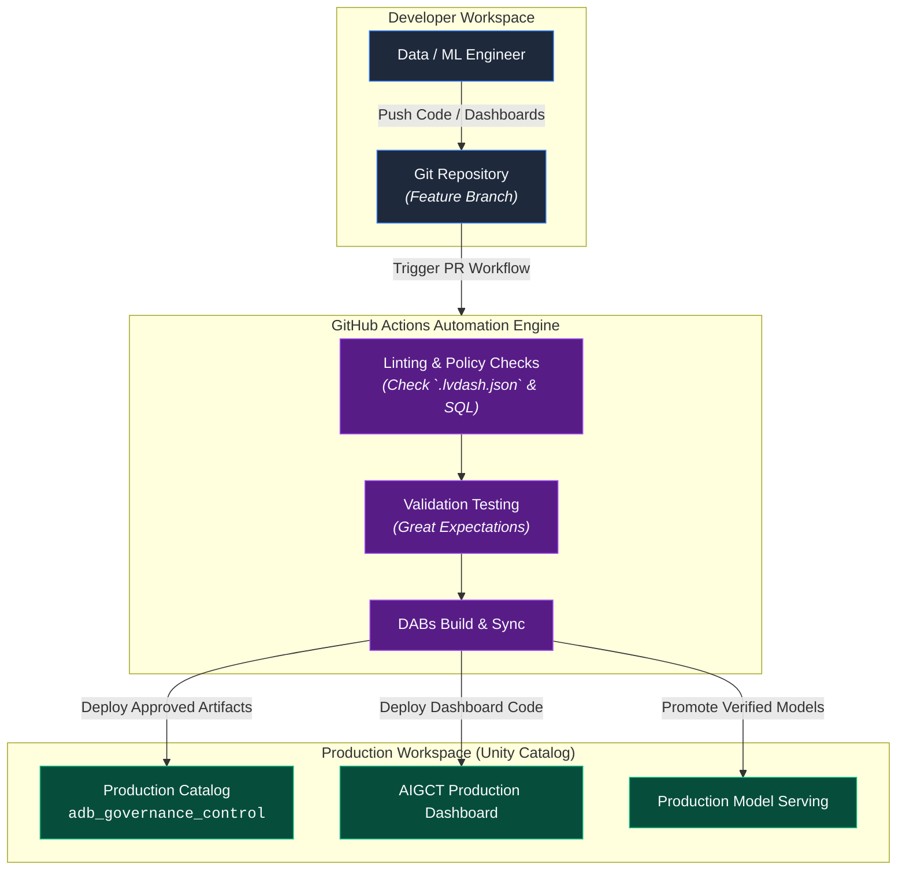

# 08. Continuous Governance and CI CD Engine

## Executive Summary

The **Continuous Governance and CI/CD Engine** embodies **Pillar 4 (Continuous Governance)** of the **AI Governance Control Tower (AIGCT)**. In fast-paced enterprise environments, static security and policy rules quickly become stale. Governance must evolve alongside codebase updates, model retraining, and schema iterations.

Operating across **Layer 4 (Governance & Policy Engine)**, this framework treats governance rules, dashboard metrics, data quality gates, and security configurations as software artifacts ("Governance-as-Code"). Utilizing **GitHub Actions**, **Databricks Asset Bundles (DABs)**, and automated policy testing, AIGCT guarantees that no model, pipeline, or dashboard is promoted to production without passing strict policy checks.

## Architectural Principles

1. **Governance-as-Code:** All security rules, data quality expectations, masking policies, and dashboards (`.lvdash.json`) are version-controlled in Git.
2. **Automated Promotion Gates:** Code and model deployments across environments (Dev $\rightarrow$ Staging $\rightarrow$ Prod) must pass automated policy compliance checks before deployment.
3. **Drift and Policy Guardrails:** Any pull request attempting to bypass row-level security or disable quality checks is automatically blocked by CI/CD linter workflows.

## Continuous Governance Pipeline Architecture



## Deployment & Verification Sequence

```mermaid
sequenceDiagram
    autonumber
    actor Engineer as Data Engineer
    participant GitHub as GitHub Actions Runner
    participant DevUC as Dev Unity Catalog
    participant ProdUC as Prod Unity Catalog
    participant Dash as Databricks Lakehouse Dashboards

    Engineer->>GitHub: Create Pull Request (Update Policy or Dashboard `.lvdash.json`)
    
    rect rgb(30, 41, 59)
        note over GitHub: Step 1: Governance Policy Linting
        GitHub->>GitHub: Verify SQL Masking Functions & Tag Standards
        GitHub->>GitHub: Validate `.lvdash.json` Dashboard Schema Syntax
    end

    rect rgb(30, 41, 59)
        note over GitHub, DevUC: Step 2: Integration & Quality Gate Validation
        GitHub->>DevUC: Execute Great Expectations Circuit Breaker Test
        DevUC-->>GitHub: Test Pass Confirmation
    end

    Engineer->>GitHub: Merge Pull Request to Main
    
    rect rgb(30, 41, 59)
        note over GitHub, ProdUC: Step 3: Production Release (DABs)
        GitHub->>ProdUC: Apply Unity Catalog Grants, Row Masks, & Dynamic Policies
        GitHub->>Dash: Update Production Control Tower Dashboard (`.lvdash.json`)
    end
```



## Technical Deep-Dive: GitHub Actions CI/CD Workflow

The following GitHub Actions workflow automates the validation and cross-workspace deployment of governance artifacts and Lakehouse dashboards:

```yaml
name: AIGCT Continuous Governance Pipeline

on:
  pull_request:
    branches: [ main ]
    paths:
      - 'src/**'
      - 'dashboards/**'
      - 'policies/**'
  push:
    branches: [ main ]

jobs:
  validate-governance:
    name: Policy & Quality Gate Validation
    runs-on: ubuntu-latest
    steps:
      - name: Checkout Code
        uses: actions/checkout@v3

      - name: Set up Python
        uses: actions/setup-python@v4
        with:
          python-version: '3.10'

      - name: Install Governance Dependencies
        run: |
          python -m pip install --upgrade pip
          pip install databricks-cli pytest great_expectations sqlfluff

      - name: Lint Governance SQL Policies
        run: |
          echo "Linting Unity Catalog Row and Column Level Security Statements..."
          sqlfluff lint policies/ --dialect databricks

      - name: Validate Dashboard JSON Schema
        run: |
          echo "Validating AIGCT Dashboard Definition (.lvdash.json)..."
          python -c "import json; json.load(open('dashboards/aigct_control_tower.lvdash.json'))"

  deploy-production:
    name: Deploy to Production Workspace
    needs: validate-governance
    if: github.ref == 'refs/heads/main' && github.event_name == 'push'
    runs-on: ubuntu-latest
    steps:
      - name: Checkout Code
        uses: actions/checkout@v3

      - name: Setup Databricks CLI
        uses: databricks/setup-cli@main

      - name: Deploy Databricks Asset Bundle (DABs)
        env:
          DATABRICKS_HOST: ${{ secrets.DATABRICKS_PROD_HOST }}
          DATABRICKS_TOKEN: ${{ secrets.DATABRICKS_PROD_TOKEN }}
        run: |
          databricks bundle deploy --target prod

      - name: Sync Lakehouse Dashboard Code
        env:
          DATABRICKS_HOST: ${{ secrets.DATABRICKS_PROD_HOST }}
          DATABRICKS_TOKEN: ${{ secrets.DATABRICKS_PROD_TOKEN }}
        run: |
          echo "Syncing updated .lvdash.json to Production Dashboard API..."
          databricks workspace import dashboards/aigct_control_tower.lvdash.json /Shared/AIGCT/aigct_control_tower.lvdash.json --format AUTO --overwrite
```

## Governance Promotion Matrix

To ensure clear isolation of duties, environments are governed by distinct automation roles:

| **Environment** | **Purpose** | **Target Catalog** | **Promotion Condition** | **Deployment Trigger** |
| Development | Rule creation & local testing | ⁠adb_governance_dev⁠ | Developer Commit | Feature Branch Push |
| Staging | Automated data quality & drift dry-runs | adb_governance_stage | Unit & Integration Tests Pass | Pull Request Open |
| Production | Live governance, monitoring & auditing | adb_governance_control | Approved PR & Security Sign-off | Merge to main |

## Key Benefits for AI Governance

- **1. Elimination of Configuration Drift:** Guarantees that production security rules and dashboards perfectly reflect the audited Git repository state.
- **2. Shift-Left Security:** Catch compliance violations, broken schema changes, or missing column masks early during the code review process.
- **3. Repeatable & Scalable:** Allows new workspaces, models, or data sources to be onboarded instantly using standardized deployment templates.
