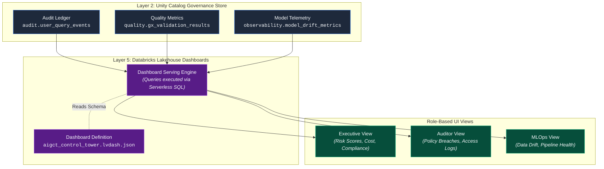

# 09. Databricks Lakehouse Dashboard Architecture

## Executive Summary

The **Databricks Lakehouse Dashboard Architecture** represents **Layer 5 (Visualization & UI)** of the **AI Governance Control Tower (AIGCT)**. While the underlying engines (Active Protection, Observability, Telemetry) continuously process and enforce governance rules, this layer provides the "Single Pane of Glass" required by stakeholders to monitor the health and compliance of the AI ecosystem.

Leveraging native Databricks Lakehouse Dashboards and managed strictly as code (`.lvdash.json`), this architecture surfaces real-time insights tailored to distinct personas—from Chief Data/AI Officers needing high-level compliance metrics, to MLOps engineers debugging data drift.

## Architectural Principles

1. **Single Pane of Glass:** All metrics (data quality, ML observability, audit logs, and security telemetry) are aggregated into a centralized dashboard ecosystem, eliminating the need to pivot between disparate monitoring tools.
2. **Dashboards-as-Code:** Dashboards are defined as `.lvdash.json` files, version-controlled in Git, and deployed via Databricks Asset Bundles (DABs) alongside the pipelines they monitor.
3. **Persona-Driven Views:** UI components and data aggregations are logically separated to serve the specific needs of Executives, Compliance Auditors, and MLOps Engineers.
4. **Direct-to-Lakehouse Querying:** Dashboards query the `adb_governance_control` catalog directly, ensuring visualizations always reflect the most current, single-source-of-truth data without requiring secondary data extracts.

## Visualization Topology & Data Flow



## Persona-Driven Dashboard Canvas

The AIGCT Dashboard is organized into three primary tabs, each mapping to a specific stakeholder requirement:

### 1. Executive / CDO View (The "Control Tower")
- **Target Audience:** Chief Data Officer, Chief AI Officer, IT Leadership.
- **Key Metrics:**
  - **Global AI Risk Score:** An aggregated metric indicating overall compliance health across all production models.
  - **Regulatory Alignment:** Boolean indicators (Pass/Fail) for EU AI Act, NIST AI RMF, and internal policies.
  - **Cost & Carbon Footprint:** Total compute cost and estimated carbon emissions for ML workloads, derived from ⁠system.billing.usage⁠.
### 2. Compliance & Auditor View
- **Target Audience:** Governance, Risk, and Compliance (GRC) teams, External Auditors.
- **Key Metrics:**
  - **Access Denials & Anomalies:** Spike charts showing rejected queries or unauthorized access attempts.
  - **Policy Evolution Tracker:** Timeline of when row/column masking policies were created, modified, or dropped.
  - **Data Lineage Explorer:** Tabular views of the exact data sets (and their versions) used to train specific model iterations.
### 3. MLOps & Data Engineering View
- **Target Audience:** Data Engineers, ML Engineers, Data Scientists.
- **Key Metrics:**
  - **Data Quality Circuit Breakers:** Real-time status of Great Expectations tests across ingestion pipelines.
  - **Feature & Concept Drift:** Visual alerts (KS-Test and Chi-Square outputs) flagging when production data deviates from training baselines.
  - **Model Latency & Endpoint Health:** Request volume, error rates, and inference latency for active model endpoints.

## Dashboards-as-Code Implementation (⁠.lvdash.json⁠)

By storing the dashboard layout and queries in a ⁠.lvdash.json⁠ file, AIGCT integrates UI updates directly into the CI/CD pipeline. Below is a conceptual snippet illustrating how a widget (e.g., tracking failed quality tests) is defined as code:

```JSON
{
  "pages": [
    {
      "name": "MLOps View",
      "widgets": [
        {
          "type": "chart",
          "title": "Failed Data Quality Gates (Last 7 Days)",
          "dataset": "quality_validation_summary",
          "queries": [
            "SELECT pipeline_name, COUNT(*) as failures FROM adb_governance_control.quality.gx_validation_results WHERE success = false AND run_time >= current_date() - 7 GROUP BY pipeline_name"
          ],
          "visualization": {
            "type": "bar",
            "x_axis": "pipeline_name",
            "y_axis": "failures",
            "color_palette": ["#EF4444"]
          }
        }
      ]
    }
  ]
}
```

## Key Benefits for AI Governance

- **1. Auditable UI Changes:** Because the dashboard is managed as code, any changes to how compliance metrics are calculated or displayed are tracked in Git, preventing "metric manipulation."
- **2. Zero-Latency Reporting:** Lakehouse Dashboards run directly on the data warehouse, meaning the moment a policy breach occurs or a model drifts, it is visible on the dashboard.
- **3. Frictionless Onboarding:** When a new ML model is deployed to production, the underlying queries automatically pick up its telemetry—no manual dashboard updates required.

