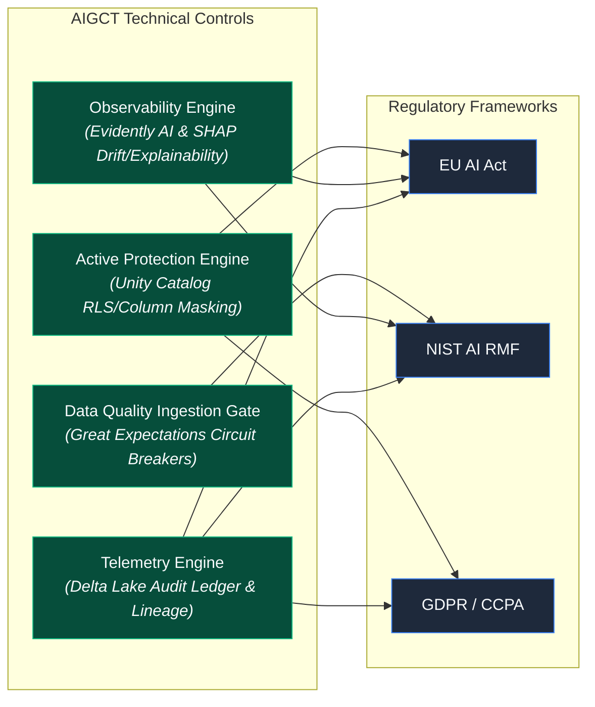

# 10. Risk Matrix and Compliance Alignment

## Executive Summary

The **Risk Matrix and Compliance Alignment** document serves as the regulatory bridge for the **AI Governance Control Tower (AIGCT)**. While technical engines enforce access control, data quality, drift detection, and telemetry, this document maps those technical controls directly to global AI regulations and compliance standards—including the **EU AI Act**, **NIST AI Risk Management Framework (AI RMF)**, **GDPR**, and **CCPA/CPRA**.

This framework transforms complex legal and ethical mandates into verifiable, code-enforced technical controls within the Databricks Lakehouse ecosystem.

---

## Architectural Principles

1. **Governance by Design:** Regulatory compliance is built directly into data pipelines, ML workflows, and storage layers, rather than treated as a manual post-hoc audit.
2. **Traceable Control Mapping:** Every compliance requirement maps directly to a specific technical control, automated job, or telemetry log within the AIGCT architecture.
3. **Continuous Compliance Verification:** Compliance is validated programmatically at every step of the CI/CD and data ingestion lifecycle, preventing non-compliant models or data from reaching production.

---

## Risk Assessment Framework

AIGCT categorizes AI assets and data assets into four distinct risk tiers, aligned with the **EU AI Act** classification system:

| Risk Tier | Description | Examples | Required AIGCT Controls |
| :--- | :--- | :--- | :--- |
| **Unacceptable Risk** | Applications violating fundamental human rights or safety. | Social scoring, subliminal manipulation. | **Blocked at Architecture Level** (Forbidden deployments). |
| **High Risk** | Critical infrastructure, HR/recruitment, credit scoring, legal AI. | Automated resume screening, loan approval ML models. | **Full AIGCT Suite Required:** Row/Column Masking, Circuit Breakers, Continuous Drift Monitoring, Immutable Auditing. |
| **Limited Risk** | Systems with specific transparency requirements. | Chatbots, AI-generated content, recommendation engines. | **Telemetry & Transparency:** Usage logging, provenance tracking via Unity Catalog. |
| **Minimal / No Risk** | Standard operational utilities. | Spam filters, internal search optimization. | **Base Governance:** Standard Unity Catalog access controls. |

---

## Technical Control Matrix (Capabilities to Frameworks)

The following matrix maps AIGCT's core technical components across Layers 1–5 to standard compliance frameworks:

## Detailed Mapping Table

| **Regulatory Mandate** | **Regulatory Framework** | **AIGCT Technical Control** | **Implementation Details** |
| :--- | :--- | :--- | :--- |
| Data Minimization & Privacy | GDPR Art. 5(1)(c)  CCPA § 1798.100 | Unity Catalog Dynamic Masking & RLS | Automatically redacts PII/PHI columns (⁠mask_pii()⁠) and filters rows based on caller's Entra ID group membership. |
| Right to Explanation | GDPR Art. 22  EU AI Act Art. 13 | SHAP Explainability & MLflow Reg | Every inference generates feature importance scores stored alongside model version lineage in MLflow |
| Data Quality & Governance | EU AI Act Art. 10  NIST AI RMF (Measure 2) | Great Expectations Circuit Breaker | Ingestion pipeline fails automatically if data health tests (nulls, schema, range drift) drop below defined thresholds. |
| Concept & Data Drift Monitoring | EU AI Act Art. 15  NIST AI RMF (Manage 2) | Evidently AI & Serverless Monitors | Automated statistical checks (KS-test, Chi-square) flag distribution shifts between training and serving payloads. |
| Traceability & Auditability | EU AI Act Art. 12  NIST AI RMF (Govern 1) | Immutable Delta Audit Ledger | Appends system query logs, workspace access, and deployment events to an append-only Delta table (⁠audit.user_query_events⁠). |
| Least Privilege Access | NIST SP 800-53  SOC 2 (CC6.1) | Explicit Workspace Entitlements | Custom workspace groups isolate roles (⁠aigct-auditors⁠, ⁠aigct-mlops⁠); avoids default broad system-group entitlements. |

## Architectural Residual Risk Matrix

Despite automated controls, system architectures retain operational risks. The table below details mitigation strategies for known failure modes:

|   | Likelihood : Low | Likelihood : High |
| :--- | :--- | :--- |
| Severity: High | [R-01] Silent Model Drift  (Mitigated via Evidently AI) | [R-02] Dynamic Policy Bypass  (Mitigated via Unity Catalog SSOT) |
| Severity: Medium | [R-03] CI/CD Drift / Manual Edit  (Mitigated via DABs & GitOps) | [R-04] Audit Log Retention Expire  (Mitigated via Delta Lake Append-Only) |

