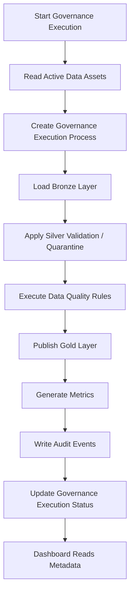

# Data Ingestion Process Flow & Metadata Architecture Mapping

This document details the chronological execution flow of the data ingestion engine for the **AI Governance Control Tower (AIGCT)** and defines how each processing stage maps to the core metadata layer.

---

## High-Level Process Flow

## Detailed Phase Mapping

### 1. Start Governance Execution

- **Action:** The system initiates a daily orchestrator batch run.
- **Metadata Impact:** Inserts a master tracking record with a status of 'In Progress' and an overall status of 'RUNNING'.
- **Target Table:** aigct_core.governance_execution

### 2. Read Active Data Assets

- **Action:** The orchestrator queries the global data asset repository to pull configurations, ingestion rules, and physical table locations for active pipelines.
- **Metadata Impact:** Read-only phase. Filters assets by active state.
- **Target Table:** aigct_core.data_asset_inventory

### 3. Create Governance Execution Process

- **Action:** The orchestrator spins up explicit, independent sub-task processing loops for each unique data asset payload or system maintenance activity.
- **Metadata Impact:** Generates a structured child tracking process reference ID mapped to the main batch run.
- **Target Table:** aigct_core.governance_execution_process

### 4. Load Bronze

- **Action:** Parses incoming raw source streams or files directly into relational tables within the raw ingestion tier.
- **Metadata Impact:** Dynamically counts total data structures ingested and writes to audit records.
- **Target Schema & Table:** aigct_bronze.\*, aigct_core.audit_event

### 5. Apply Silver Validation / Quarantine

- **Action:** Evaluates incoming file schemas, layout contracts, and required structural parameters. Valid clean rows are moved forward; corrupted or broken rows are split off into isolation.
- **Metadata Impact:** Tracks data operational volumes.
- **Target Schema/Tables:** aigct_silver.\*, aigct_quarantine.\*, and metric tracking inside aigct_core.governance_execution_process.

### 6. Execute Data Quality Rules

- **Action:** Evaluates business semantic directives (e.g., uniqueness, completeness, checks) against rows moved into the Silver tier.
- **Metadata Impact:** Logs granular evaluation audit checks and quality score percentages.
- **Target Tables:** igct_core.quality_rule_definition (reads rules) $\rightarrow$ aigct_core.data_quality_results (writes results)

### 7. Publish Gold

- **Action:** Aggregates and materializes verified, compliant domain datasets into standardized canonical semantic business models ready for corporate reporting.
- **Target Schema/table:** aigct_gold.\*, aigct_core.governance_metrics

### 8. Generate Metrics

- **Action:** Compiles the runtime operational profiles, dataset metrics, quality thresholds, and duration metrics across the medallion run.
- **Metadata Impact:** Persists operational KPIs categorized by domain focus areas.
- **Target Table:** aigct_core.governance_metrics

### 9. Write Audit Events

- **Action:** Explicitly captures critical state changes or operational events (e.g., validation failures, exceptions, manual overrides) for compliance trails.
- **Metadata Impact:** Chronological capture of state changes.
- **Target Table:** aigct_core.audit_event

### 10. Update Governance Execution Status

- **Action:** Concludes the global batch execution window. Calculates macro processing time and computes final data payload health status attributes.
- **Metadata Impact:** Updates the master tracking row status to 'Completed' or 'Failed', sets final durations, and maps the final overall_status.
- **Target Table:** aigct_core.governance_execution

### 11. Dashboard Reads Metadata

- **Action:** The Streamlit interactive web client queries the metadata tables to populate the reactive analytics interface.
- **Operational Impact:** Displays real-time executive summaries, quality stats, and drill-downs into dataset and model states without touching underlying silver/gold financial files.
- **Target Tables:** aigct_core.governance_execution, aigct_core.governance_execution_process, aigct_core.governance_metrics, aigct_core.data_quality_results, and aigct_core.audit_event.
